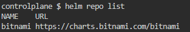
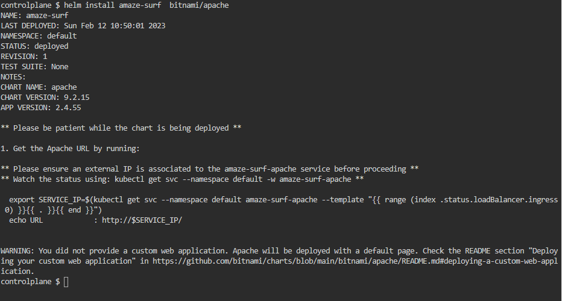
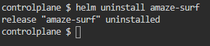
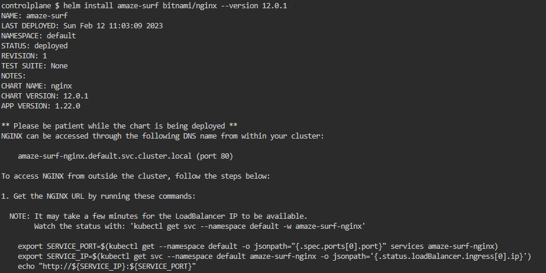
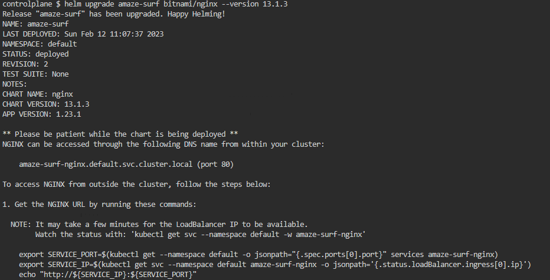
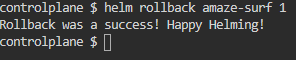

### 1- Add bitnami helm chart repository in the controlplane node
install helm in ubuntu:
```bash
curl https://baltocdn.com/helm/signing.asc | gpg --dearmor | sudo tee /usr/share/keyrings/helm.gpg > /dev/null
sudo apt-get install apt-transport-https --yes
echo "deb [arch=$(dpkg --print-architecture) signed-by=/usr/share/keyrings/helm.gpg] https://baltocdn.com/helm/stable/debian/ all main" | sudo tee /etc/apt/sources.list.d/helm-stable-debian.list
sudo apt-get update
sudo apt-get install helm
```

#### add bitnami repo:
```bash
helm repo add bitnami https://charts.bitnami.com/bitnami
```



### 2-Deploy the Apache application on the cluster using the apache from the bitnami repository. Set the release Name to: amaze-surf
```bash
helm install amaze-surf  bitnami/apache
```


### 3-Uninstall the apache chart release  from the cluster
```bash
helm uninstall amaze-surf  bitnami/apache
```


### 4- install specfic version of nginx 1.22.0, then update it to specfic 1.23.1 , then rollback
search inside the repo to get the chart:
```bash
 helm search repo nginx
```
search on the version of this chart:
```bash
 helm search repo nginx --versions
```
install version of nginx 1.22.0:
```bash
helm install amaze-surf bitnami/nginx --version 12.0.1
```


update the version to 1.23.1:
```bash
helm upgrade amaze-surf bitnami/nginx --version 13.1.3
```


rollback the version:
```bash
helm rollback amaze-surf 1
```


