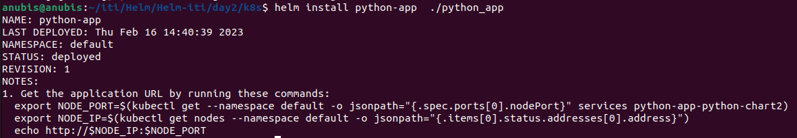
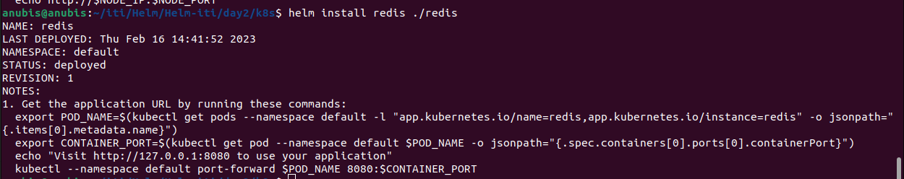
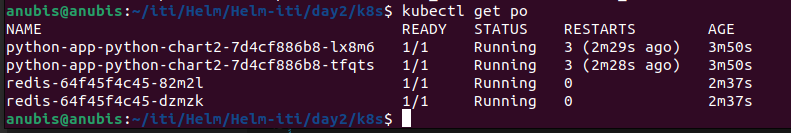
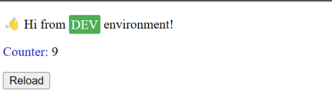

install helm in ubuntu:
```bash
curl https://baltocdn.com/helm/signing.asc | gpg --dearmor | sudo tee /usr/share/keyrings/helm.gpg > /dev/null
sudo apt-get install apt-transport-https --yes  
echo "deb [arch=$(dpkg --print-architecture) signed-by=/usr/share/keyrings/helm.gpg] https://baltocdn.com/helm/stable/debian/ all main" | sudo tee /etc/apt/sources.list.d/helm-stable-debian.list
sudo apt-get update
sudo apt-get install helm
```

install redis repo
```bash
 helm create redis
```
create python chart:
```bash
helm create python_app 
```
install docker and pull python image:
```bash
docker pull 95remon/python-project
docker pull redis
```

install redis and python-app charts:
```bash
helm install python-app  ./python_app
helm install redis ./redis
```




## output 






